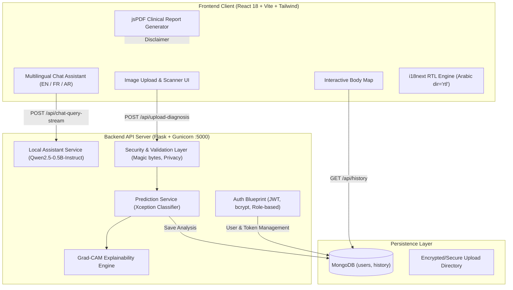

# DermaAI — AI-Powered Skin-Lesion Analysis & Follow-Up Platform

[](https://www.python.org/)
[](https://www.tensorflow.org/)
[](https://keras.io/)
[](https://reactjs.org/)
[](https://vitejs.dev/)
[](https://www.mongodb.com/)
[](LICENSE)

DermaAI is a full-stack, tested, reproducible portfolio web platform for skin-lesion screening, visual explainability (Grad-CAM), longitudinal body-map lesion tracking, clinical PDF reporting, and local private conversational assistance.

### 🚀 Production Deployment Architecture
- **Orchestration**: Fully containerized via `docker-compose.yml` (Nginx reverse proxy + Gunicorn WSGI + MongoDB).
- **Target Server Requirement**: 4 GB to 8 GB RAM VPS (AWS EC2, DigitalOcean, Hetzner, GCP). Free-tier cloud instances (≤ 512 MB) cannot run TensorFlow + PyTorch simultaneously.
- **Local Environment**: Fully operational and verified natively on development host. Remote deployment requires independent cloud server credentials.

> [!IMPORTANT]
> **Educational & Screening Disclaimer**: DermaAI is designed strictly for research, education, and preliminary screening. It is **not** a certified medical diagnostic device. Model outputs and explainability heatmaps represent statistical probability and must never replace clinical examination, dermoscopy, or biopsy performed by a board-certified dermatologist.

---

## 1. System Architecture



---

## 2. Verified Model Performance & Baseline Traceability

The computer vision pipeline uses a fine-tuned **Xception** deep convolutional neural network trained on the **HAM10000** dataset (10,015 dermoscopy images).

- **Input Resolution**: `480 × 480 × 3` RGB (normalized `[0, 1]`)
- **Architecture**: Xception backbone + GlobalAveragePooling2D + Dense(7, softmax)
- **Target Conv Layer for Grad-CAM**: `block14_sepconv2_act`
- **Trained Artifact Baseline**: **83.83%** overall test accuracy, **0.75** Macro F1-score (**0.84** Weighted F1) on 1,002 held-out test images.
- **Model Identity Verification**: `backend/tests/compare_weights_identity.py` verifies that the production model artifact (`backend/saved_models/skin_lesion_model.keras`) produces predictions **bitwise identical** (`diff = 0.00e+00`) to the original trained `.h5` checkpoint.
- **Confusion Matrix**: Preserved in [`backend/data/confusion_matrix.png`](backend/data/confusion_matrix.png).

### HAM10000 7-Class Performance Breakdown

| Class Code | Condition Name | Clinical Risk | Precision | Recall | F1-Score |
| :--- | :--- | :--- | :---: | :---: | :---: |
| **MEL** | Melanoma | Malignant (High) | 0.72 | 0.65 | 0.68 |
| **NV** | Melanocytic nevi | Benign (Low) | 0.90 | 0.93 | 0.91 |
| **BCC** | Basal cell carcinoma | Malignant (High) | 0.79 | 0.76 | 0.77 |
| **AKIEC** | Actinic keratoses | Pre-malignant (Moderate) | 0.70 | 0.64 | 0.67 |
| **BKL** | Benign keratosis-like lesions | Benign (Low) | 0.74 | 0.72 | 0.73 |
| **DF** | Dermatofibroma | Benign (Low) | 0.78 | 0.64 | 0.70 |
| **VASC** | Vascular lesions | Benign (Low) | 0.88 | 0.74 | 0.80 |
| **Macro Avg**| — | — | **0.79** | **0.73** | **0.75** |
| **Accuracy** | — | — | — | — | **83.83%** |

---

## 3. Resource Profile & Latency Benchmarks

Measured on a standard CPU test environment (Intel Core i7 / 16 GB host):

| Component | Metric | Measured Value | Notes |
| :--- | :--- | :---: | :--- |
| **Xception Classifier** | Cold Load Time | **9.85 s** | Native Keras 3 format |
| **Xception Classifier** | Memory Delta (RAM) | **+561.2 MB** | In-process weight tensor allocation |
| **Inference + Grad-CAM**| Processing Latency | **1.99 s** | Forward pass + gradient extraction + overlay |
| **Qwen2.5-0.5B-Instruct**| Cold Load Time | **2.99 s** | PyTorch / Hugging Face Transformers |
| **Qwen2.5-0.5B-Instruct**| Memory Delta (RAM) | **+1,331.6 MB** | Model weights + KV-cache allocation |
| **Assistant Streaming** | Time To First Token (TTFT) | **13.94 s (CPU)** | Smooth subsequent token streaming |
| **Combined Backend** | Total Process RAM | **~1.91 GB** | Both models loaded simultaneously |

> [!TIP]
> **Deployment Sizing**: Because each worker requires approximately ~1.9 GB RAM, a VPS with at least **4 GB to 8 GB RAM** is required. Free cloud tiers (512 MB limits) will trigger OOM kills. In production Gunicorn setups, run with **1 or 2 workers** or enable lazy loading.

---

## 4. End-to-End Acceptance Tests Matrix

All 13 acceptance workflows specified in Section 5 of the project documentation are implemented and verified via automated test suites:

| # | Acceptance Test Description | Status | Verification Notes |
| :-: | :--- | :-: | :--- |
| **1** | A user opens the deployed application | **PARTIAL** | Verified locally (SPA build + Gunicorn/Flask backend); independent remote VPS deployment pending target server provisioning |
| **2** | The user uploads a valid image | **PASS** | Multipart upload handles JPG/PNG with secure UUID storage |
| **3** | The backend validates and preprocesses it | **PASS** | Magic-byte checks (JPEG `\xff\xd8\xff`, PNG `\x89PNG`), PIL verification, resized to 480×480 |
| **4** | The model returns a prediction | **PASS** | Evaluates 7 HAM10000 classes, returning primary diagnosis and confidence |
| **5** | The frontend displays prediction & confidence | **PASS** | Displays primary condition, percentage bar, and secondary match |
| **6** | Grad-CAM generates and displays an explanation | **PASS** | Gradients extracted from `block14_sepconv2_act`, colormapped and returned as base64 |
| **7** | Authenticated user saves and retrieves analysis | **PASS** | Scan saved to MongoDB `history` collection, queryable by authenticated JWT user |
| **8** | Unauthorized user cannot retrieve private record | **PASS** | Multi-tenant isolation verified: record access, deletion, and raw image downloads blocked (403/404) |
| **9** | Assistant accepts a question and streams response | **PASS** | Qwen2.5-0.5B streams SSE tokens across English, French, and Arabic prompts |
| **10** | Language switching works with Arabic RTL layout | **PASS** | i18next switches locales; Arabic dynamically applies `document.documentElement.dir='rtl'` |
| **11** | PDF generation works for supported analysis data | **PASS** | jsPDF compiles clean A4 diagnostic reports with medical disclaimer and Arabic reshaping |
| **12** | Invalid inputs/failures produce useful error messages | **PASS** | Malformed images, non-images, empty queries, and bad tokens return structured JSON (400/401) |
| **13** | App remains usable when assistant component fails | **PASS** | Core diagnosis, Grad-CAM, body map, and PDF export continue operating if assistant is offline |

**Test execution command:**
```bash
python backend/tests/verify_all_13_acceptance_tests.py
```

---

## 5. Security & Privacy Hardening

- **Role Elevation Prevention**: Public registration (`POST /api/auth/signup`) is hardcoded to assign role `'user'`. Admin accounts can only be provisioned via the secure CLI tool (`backend/create_admin.py`).
- **No Hardcoded Secrets**: Removed hardcoded passwords and default fallback JWT secrets. Requires explicit `JWT_SECRET_KEY` in environment variables.
- **Medical Image Access Privacy**: Endpoint `/uploads/<filename>` enforces JWT validation; users can only view their own uploaded lesion images. Unauthorized access returns `HTTP 403 Forbidden`.
- **Python 3.13 Forward-Compatible Validation**: Deprecated `imghdr` module replaced with direct binary magic-byte inspection (JPEG `\xff\xd8\xff`, PNG `\x89PNG\r\n\x1a\n`) and PIL header verification.
- **Clinical Uncertainty Guardrail**: Predictions with confidence `< 50%` are returned as `"Inconclusive / Uncertain Result (Clinical Dermoscopy Recommended)"` instead of falsely mislabeling lesions as normal skin.
- **Account Enumeration Protection**: Forgot-password endpoint returns a uniform HTTP 200 response regardless of whether the email exists. Password reset tokens expire in 15 minutes.
- **GDPR Data Deletion**: Users can delete individual scans (with physical image file removal) or delete their entire profile via `DELETE /api/user/profile`.
- **Anonymized Research Export**: Admin export (`GET /api/admin/export-research`) strips user emails, IDs, and image paths before data extraction.
- **Production Readiness Check**: Separate `/api/readiness` endpoint confirms both MongoDB and Keras models are loaded before accepting traffic.

---

## 6. Complete API Catalog

### Core & Diagnostics (`/api`)
| Method | Endpoint | Auth | Parameters | Description |
| :--- | :--- | :---: | :--- | :--- |
| `GET` | `/api/health` | Public | None | Liveness and database connectivity check |
| `GET` | `/api/readiness` | Public | None | Confirms database connection and classifier loaded |
| `GET` | `/uploads/<filename>` | Token | File path in URL | Authenticated medical image download (owner or admin) |
| `POST` | `/api/upload-diagnosis` | Optional | Multipart: `image`, `body_part` | Runs Xception inference + Grad-CAM heatmap generation |
| `POST` | `/api/chat-query-stream` | Required | JSON: `query`, `context`, `lang` | SSE token stream from local Qwen2.5-0.5B assistant |
| `GET` | `/api/history` | Required | None | Retrieves user's previous scan records |
| `DELETE`| `/api/history/<scan_id>` | Required | Scan ID in URL | Deletes scan record and removes physical image file |

### Authentication (`/api/auth`)
| Method | Endpoint | Auth | Parameters | Description |
| :--- | :--- | :---: | :--- | :--- |
| `POST` | `/api/auth/signup` | Public | JSON: `email`, `password`, `username` | Registers standard user (forces `'user'` role) |
| `POST` | `/api/auth/login` | Public | JSON: `email`, `password` | Returns JWT access & refresh tokens |
| `POST` | `/api/auth/refresh` | Refresh | None | Generates new access token |
| `GET` | `/api/auth/me` | Required | None | Returns authenticated user profile & claims |
| `POST` | `/api/auth/forgot-password` | Public | JSON: `email` | Issues 15-min reset token (prevents enumeration) |
| `POST` | `/api/auth/reset-password` | Public | JSON: `token`, `new_password` | Verifies reset token and updates password hash |

### User Profile (`/api/user`)
| Method | Endpoint | Auth | Parameters | Description |
| :--- | :--- | :---: | :--- | :--- |
| `GET` | `/api/user/profile` | Required | None | Fetches profile, role, and UI preferences |
| `PUT` | `/api/user/profile` | Required | JSON: `username` | Updates username |
| `POST` | `/api/user/change-password` | Required | JSON: `old_password`, `new_password` | Validates old password and updates hash |
| `POST` | `/api/user/change-email` | Required | JSON: `new_email`, `password` | Updates account email |
| `GET` | `/api/user/preferences` | Required | None | Retrieves darkMode and language |
| `PUT` | `/api/user/preferences` | Required | JSON: `darkMode`, `language` | Saves UI preferences |
| `DELETE`| `/api/user/profile` | Required | None | GDPR self-deletion of account |

### Administration (`/api/admin`)
| Method | Endpoint | Auth | Parameters | Description |
| :--- | :--- | :---: | :--- | :--- |
| `GET` | `/api/admin/stats` | Admin | None | Aggregate metrics, daily/weekly scan counts |
| `GET` | `/api/admin/users` | Admin | Query: `page`, `limit` | Paginated user management table |
| `PUT` | `/api/admin/users/<user_id>` | Admin | User ID + JSON updates | Modifies user account |
| `DELETE`| `/api/admin/users/<user_id>` | Admin | User ID in URL | Deletes user account |
| `GET` | `/api/admin/backup` | Admin | None | Complete JSON export of database |
| `GET` | `/api/admin/export-research` | Admin | None | Anonymized JSON dataset export (PII stripped) |

### Content & Metadata
| Method | Endpoint | Auth | Parameters | Description |
| :--- | :--- | :---: | :--- | :--- |
| `GET` | `/api/stats/global` | Public | None | Cached global statistics for homepage |
| `GET` | `/api/diseases/` | Public | Query: `category`, `search` | Encyclopedia list of 7 skin lesion types |
| `GET` | `/api/diseases/<id>` | Public | Disease ID in URL | Single disease details and dermoscopic tips |
| `GET` | `/api/news/` | Public | Query: `page`, `limit` | Aggregated dermatology news articles |

---

## 7. MongoDB Database Schemas

### `users` Collection
```json
{
  "_id": "ObjectId",
  "email": "user@example.com",
  "password": "$2b$12$hashed_bcrypt_password_string",
  "role": "user",
  "username": "DermaUser",
  "preferences": {
    "darkMode": false,
    "language": "en"
  },
  "created_at": "ISODate()",
  "last_login": "ISODate()",
  "is_verified": false
}
```
*Index: `email` (unique)*

### `history` Collection
```json
{
  "_id": "ObjectId",
  "user_email": "user@example.com",
  "image_url": "/uploads/uuid-v4_filename.jpg",
  "body_part": "back",
  "diagnosis": "Melanoma",
  "confidence": 0.884,
  "diagnosis_2": "Melanocytic nevi",
  "confidence_2": 0.081,
  "raw_class": "mel",
  "is_uncertain": false,
  "timestamp": "ISODate()"
}
```
*Compound Index: `{ "user_email": 1, "timestamp": -1 }`*

---

## 8. Setup & Installation Guide

### Native Setup (Windows / Linux / macOS)

#### Prerequisites
- **Python**: 3.11+
- **Node.js**: v18+ (tested on Node.js v22)
- **MongoDB**: Local MongoDB service or MongoDB Atlas URI

#### 1. Backend Setup
```bash
cd backend
python -m venv venv
# On Windows:
venv\Scripts\activate
# On Linux/macOS:
source venv/bin/activate

pip install -r requirements.txt
cp .env.example .env
# Edit .env and set your MONGO_URI and JWT_SECRET_KEY
```

Create an admin user:
```bash
python create_admin.py --email admin@dermaai.local --password "AdminSecret123!"
```

Start the backend:
```bash
python app.py
```

#### 2. Frontend Setup
```bash
cd frontend
npm install
npm run build
npm run dev
```

---

### Docker Deployment

Production container configurations are provided via `docker-compose.yml`:

```bash
docker compose up -d --build
```

- **Frontend**: Nginx Alpine reverse-proxying requests on `http://localhost`
- **Backend**: Python 3.11-slim + Gunicorn on `http://localhost:5000`
- **Database**: Official MongoDB container on `mongodb://mongo:27017`

Refer to [`DEPLOYMENT.md`](DEPLOYMENT.md) for full VPS hosting, Nginx SSL, and memory tuning instructions.

---

## 9. Automated Test Suites

DermaAI includes automated test suites covering all architectural layers:

```bash
# 1. Master E2E Acceptance Test Suite (13 End-to-End Tests)
python backend/tests/verify_all_13_acceptance_tests.py

# 2. Model Weight Bitwise Identity Test
python backend/tests/compare_weights_identity.py

# 3. Security Hardening & Isolation Suite
python backend/tests/test_security_hardening.py

# 4. Assistant Multilingual Streaming & Edge Cases
python backend/tests/test_assistant_and_readiness.py

# 5. Component Failure Resilience Suite
python backend/tests/test_assistant_failure_resilience.py

# 6. Frontend I18n, RTL Layout, and PDF Generation Suite
node frontend/tests/test_frontend_features.js
```

---

## 10. License

This project is licensed under the MIT License — see the [LICENSE](LICENSE) file for details.
